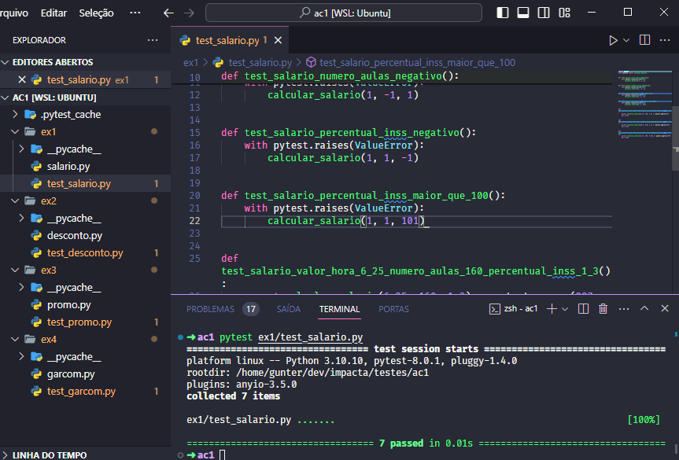
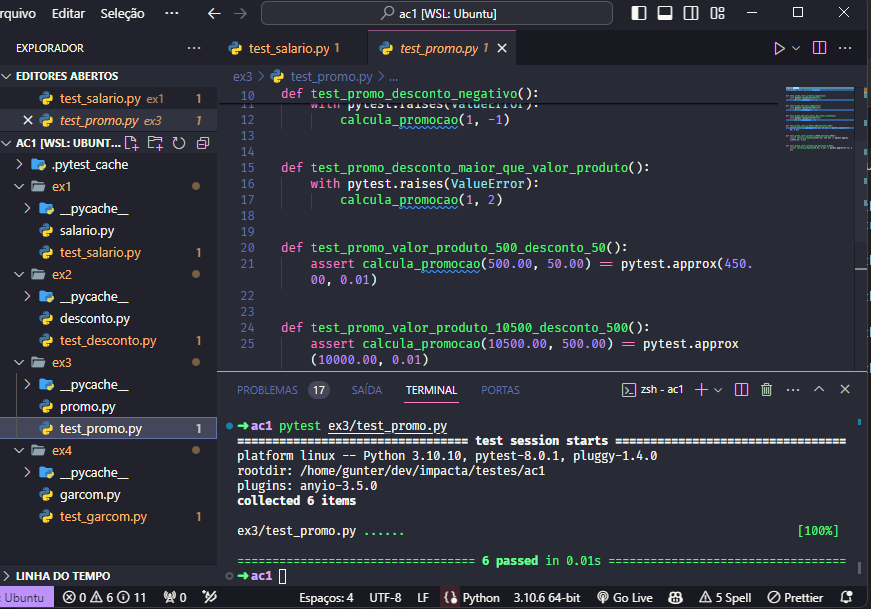
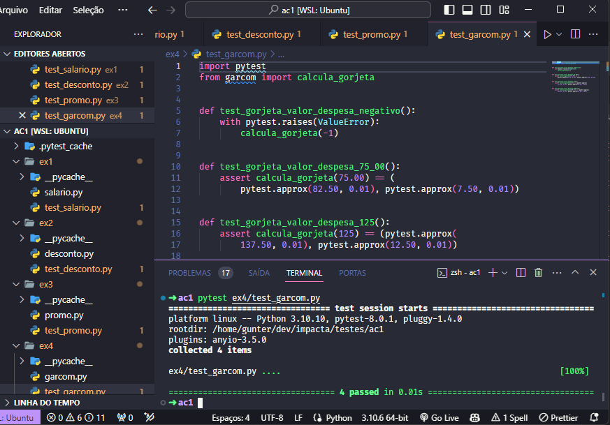

# Atividade Contínua 01

Atividade Contínua 01 da disciplina de Automação de Testes de Software.

## Integrantes

- **Vinícius Bittencourt dos Santos** - 2201032
- **Carlos Henrique de Castro Verçosa Albuquerque** - 2201063

## Instalação

```bash
pip install pytest
```

## Artefatos

Segue a lista de artefatos e suas respectivas descrições.

### Exercício 01

- Faça uma função que efetua o cálculo do salário líquido de um professor. Os dados fornecidos serão:
  - valor hora aula
  - número de aulas dadas
  - percentual de desconto do INSS.
- [Código](./ex1/salario.py)
- [Testes](./ex1/test_salario.py)



### Exercício 02

- Em épocas de pouco dinheiro, os comerciantes estão procurando aumentar suas vendas oferecendo desconto aos clientes. Faça uma função que **receba um valor de um produto** e **devolva um novo valor** tendo em vista que o **desconto foi de 9%**.
- [Código](./ex2/desconto.py)
- [Testes](./ex2/test_desconto.py)

  

### Exercício 03

- Faça uma função que leia dois números reais, um será o valor de um produto e o outro o valor do desconto que esse produto está recebendo. Devolva quantos reais o produto custa na promoção.
- [Código](./ex3/promo.py)
- [Testes](./ex3/test_promo.py)



### Exercício 04

- Todo restaurante, embora por lei não possa obrigar o cliente a pagar, cobra 10% de comissão para o garçom. Faça uma função que receba o valor gasto com despesas realizadas em um restaurante e devolva o valor total da conta e o valor da gorjeta.
- [Código](./ex4/garcom.py)
- [Testes](./ex4/test_garcom.py)


